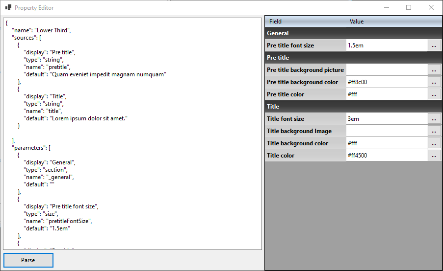

# PropertyDataGridView Demo

A sample on how customize a DataGridView on C#/WinForms to create a kind of PropertyGrid to edit properties from a DataSet.

This sample takes populates from a JSON file.

